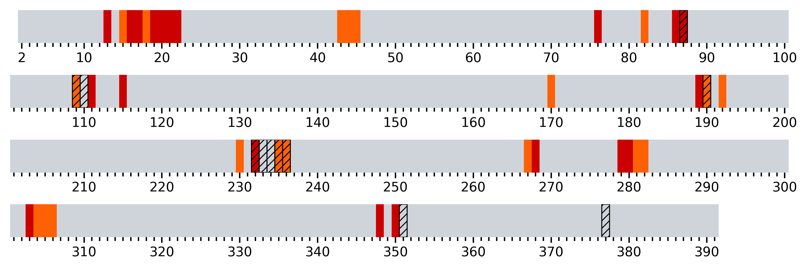
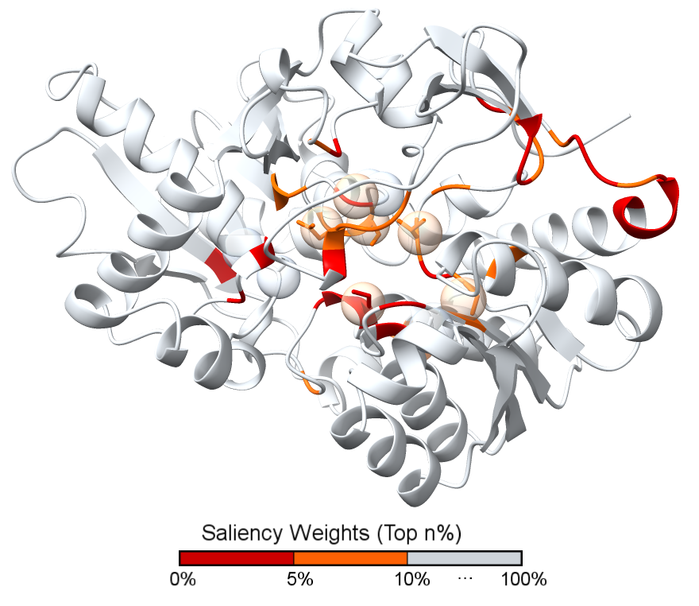

# EC-LMGraph
Enzyme function and catalytic site prediction with GCN-based deep learning framework 

#### Google Colab Notebook for EC number prediction and catalytic site prediction
The EC-LMGraph is now available on Google Colab Notebook for online prediction.

[Google Colab Notebook](https://colab.research.google.com/drive/1wt1Ky40y50qO3p4OkkZoP5jM_x4IQ6A1)

## Dependencies
EC-LMGraph requires python=3.11 and PyTorch-2.6.0

Use the following code to install the required packages:
```
pip install torch==2.6.0+cu118 torchvision==0.21.0+cu118 torchaudio==2.6.0 --index-url https://download.pytorch.org/whl/cu118

pip install torch_geometric==2.3.0
pip install pyg_lib torch_scatter torch_sparse torch_cluster torch_spline_conv -f https://data.pyg.org/whl/torch-2.6.0+cu118.html
pip install wget==3.2
pip install biopython==1.81
pip install transformers==4.28.1
pip install sentencepiece
pip install captum==0.2.0
pip install openpyxl==3.0.9
pip install matplotlib
pip install pandas==2.0.0

```


## Pretrained models and UniProt Annotations

Pretrained models are available here: 
[Models](https://www.dropbox.com/scl/fi/hrqyjpcyk9gw9u66knvve/model.pt?rlkey=gye2w77mxdwk7absvdz2vz28u&dl=0)

1. Move the models to the /models/.

An aggregated version of UniProt catalytic sites annotations are available here: 
[UniProt Annotations](https://www.dropbox.com/scl/fi/h7xs7oonc8wplrwbl4kfv/uniprot_sites.pkl?rlkey=45lz69sj01i696345yx5u6361&dl=0)

1. Move the UniProt Annotations to the /excel/uniprot_sites.pkl


## EC number prediction and catalytic site prediction
Download the target PDB structures (.cif) and place it in folder 'data'
```
python predict.py
```
To predict PDB structures under the folder 'Task 1'
```
python .\predict.py --task_name "Task 1" --target_type cif
```

To predict AlphaFold 2-predicted structures under the folder 'Task 2'
```
python .\predict.py --task_name "Task 2" --target_type af2
```


## Catalytic site prediction
The model-predicted catalytic residues can be found here. Based on the protein amino acid length, we highlight the top 10% residues as model-predicted catalytic residues and illustrate the results with M-CSA dataset/UniProtKB database.
* Red: Top 5%
* Orange: Top 5%-10%
* : M-CSA annotations
* : UniProt annotations

### Example PDB [1A50_B](https://www.rcsb.org/structure/1a50)

Prediction by amino acid positions: 1a50_B.png


Prediction by structural illustration: 1a50_B_mcsa/uniprot_sites.cxc
* Can be visualized via the [UCSF ChimeraX software](https://www.cgl.ucsf.edu/chimerax/)



* This cxc files can be downloaded at ./figures/1a50_B_mcsa.cxc


